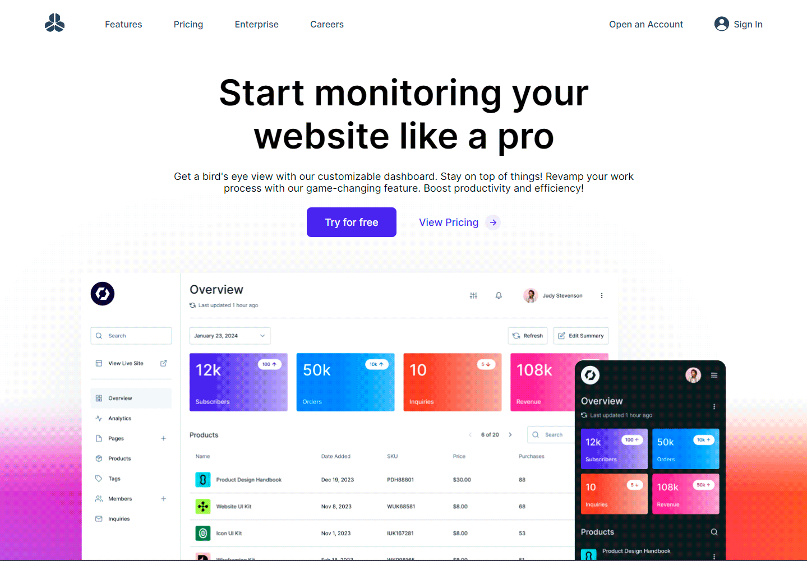

<h1 align="center">Landing Page</h1>

  
  
  
  

 

  
  

<h4 align="center">
  
  [Ver projeto](https://landing-page-02-pi.vercel.app/)
</h4>

 

  <a href="#projeto">Sobre o projeto</a> •
  <a href="#tecnologias">Tecnologias</a> •
  <a href="#layout">Layout</a>

## 💻 Sobre o projeto

O projeto é uma Landing Page desenvolvida com o objetivo de aprimorar habilidades nas tecnologias ReactJS, Vite e Styled Components e no Composition Pattern.

Caso queira ver o projeto, clique [aqui](https://landing-page-02-pi.vercel.app/).

## 🚀 Tecnologias

O projeto foi desenvolvido com as seguintes tecnologias:

- ReactJS
- Vite
- Typescript
- Styled Components

## 🔖 Layout

Você pode visualizar o layout do projeto clicando [aqui](https://www.figma.com/community/file/1328257564171258838).

## 🤝 Contribuições

Issues e pull requests são muito bem-vindos!

## 👨🏻‍💻 Autor: Gabriel Centeio Freitas 

  
  

